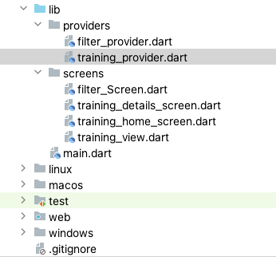
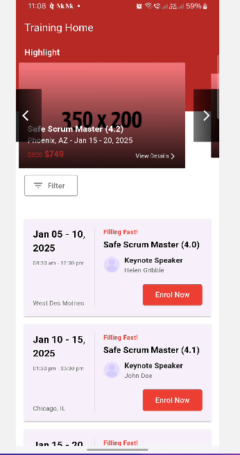
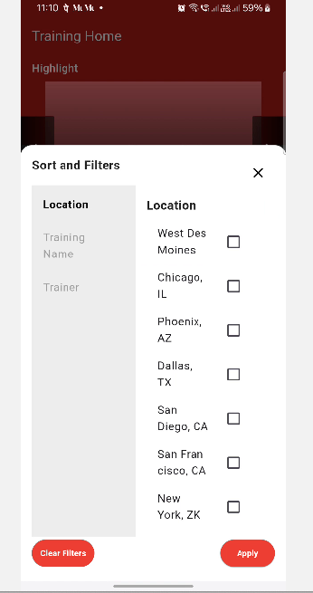
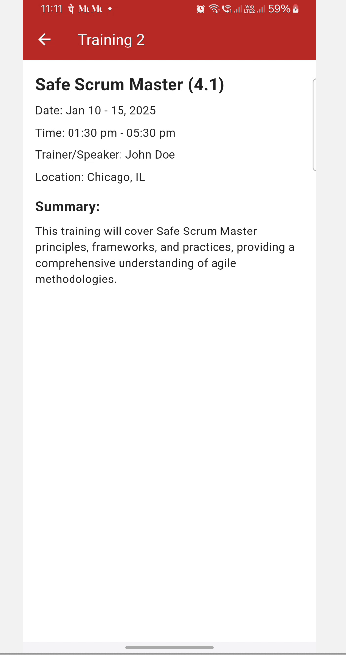

# trainings_app

My Trainings App a Flutter project.

# Screenshots

1. App Structure

2. Training Home Screen

3. Filter Screen

4. Details Screen

## Getting Started

Step-by-step instructions to run 'My Training App' Flutter app project:

1. Install Flutter SDK
   Download the latest version of the Flutter SDK from the Flutter website.
   Follow the setup instructions specific to your operating system (Windows, macOS, Linux).

2. Install an IDE
   Install an IDE like Android Studio, Visual Studio Code, or IntelliJ IDEA.
   Install the Flutter and Dart plugins in your IDE.

3. Set Up Your Development Environment
   Open a terminal and run:
   flutter doctor
   This checks for any missing dependencies or issues in your environment. Follow the instructions to resolve any warnings or errors.

4. Clone or Download the Project
   Clone the repository using Git:
   git clone <repository-url>
   Or download the ZIP file and extract it.
   Navigate to the project directory:
   cd <project-folder>

5. Install Dependencies
   Run the following command to fetch all required packages:
   flutter pub get

6. Set Up a Device
   Physical Device: Connect your Android or iOS device via USB and enable developer mode.
   Emulator/Simulator:
   For Android, launch an AVD in Android Studio.
   For iOS, start the simulator from Xcode.

7. Configure the App (Optional)
   If there are any required API keys or environment variables, configure them in the lib/constants or .env file, as specified in the project README.
   Make sure platform-specific settings (like AndroidManifest.xml or Info.plist) are correctly configured.

8. Run the App
   Run the app using the command:
   flutter run
   Alternatively, launch the app from your IDE by clicking the Run or Debug button.

9. Troubleshooting
   If you encounter issues:
   
   Run:
   flutter clean
   flutter pub get
   flutter run

   
   Use flutter doctor to check for any missing components.
   Review error logs in the console for debugging.